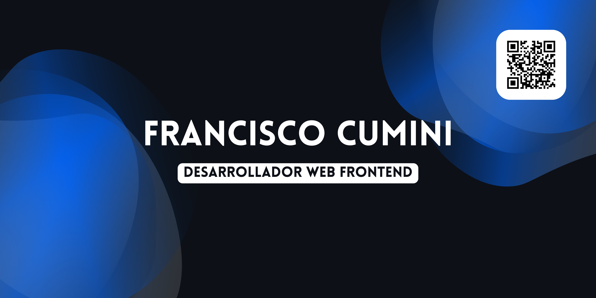

# Hola, soy Francisco Cumini 👋

### Desarrollador Web Frontend en Gen-AI Microsystems ♾️🟧🟦

Actualmente estoy estudiando la **Tecnicatura Universitaria en Programación** en la **Universidad Tecnológica Nacional, Facultad Regional Rosario** (Santa Fe, Argentina). Me apasiona el desarrollo web, y estoy enfocado en mejorar mis habilidades en **Frontend Development**.

### Tecnologías que utilizo 💻

- **HTML5**
- **CSS3**
- **JavaScript**
- **React**
- **Node JS**
- **Bootstrap**
- **Tailwind CSS**

### Acerca de mí 🚀

Soy un desarrollador frontend en formación, con un enfoque especial en construir interfaces de usuario atractivas, responsivas y funcionales. Me encuentro en constante aprendizaje y siempre buscando nuevos desafíos. 

### Contacto 📫

- Email: franciscocumini@gmail.com
- [LinkedIn](https://www.linkedin.com/in/francisco-cumini)
- [Portafolio](https://franciscocumini.com/)
